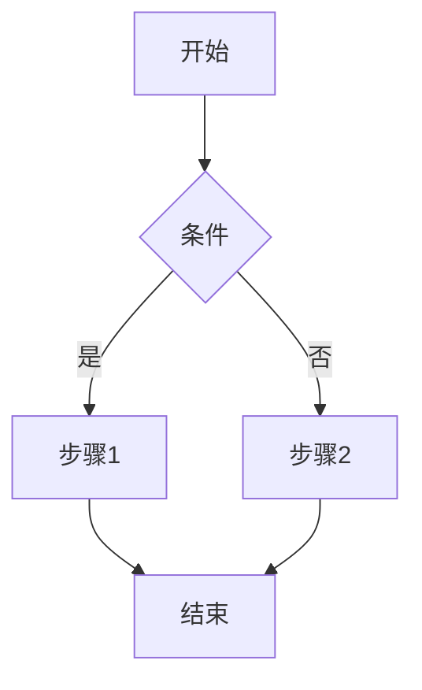
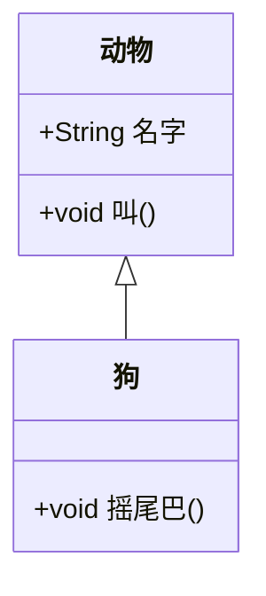
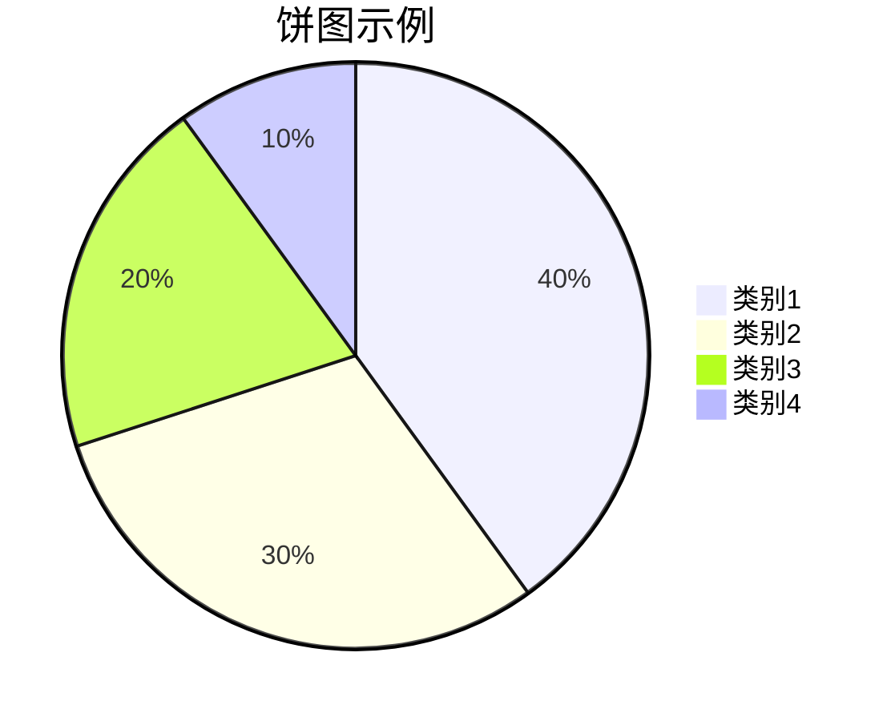

---
{"dg-publish":true,"permalink":"//","updated":"2025-02-28T18:01:35.612+08:00"}
---


```mermaid
图表代码
```




```mermaid
sequenceDiagram
    participant 用户
    participant 系统
    用户->>系统: 请求数据
    系统-->>用户: 返回数据
 ```
```mermaid
gantt
    title 项目进度
    dateFormat  YYYY-MM-DD
    section 任务A
    任务1 :a1, 2023-10-01, 7d
    任务2 :after a1, 5d
    section 任务B
    任务3 :2023-10-05, 3d
    任务4 :2023-10-10, 4d
```




